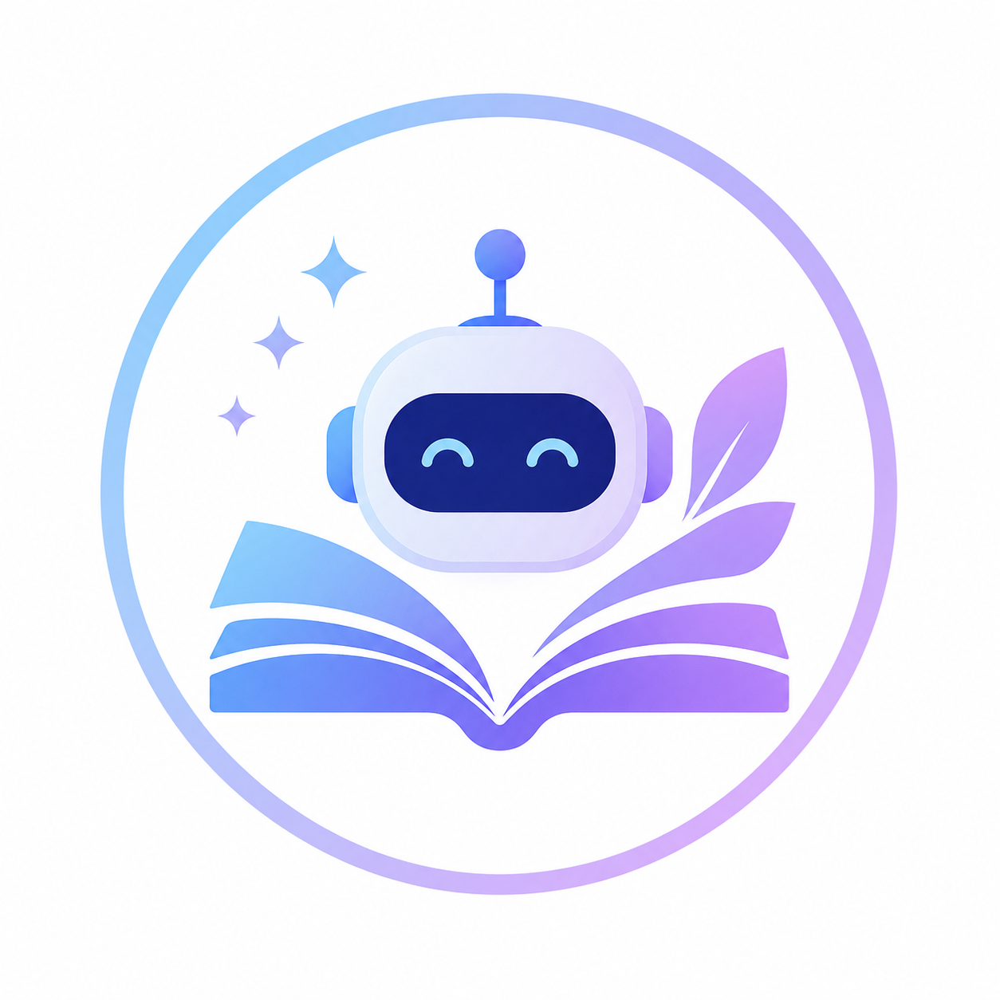
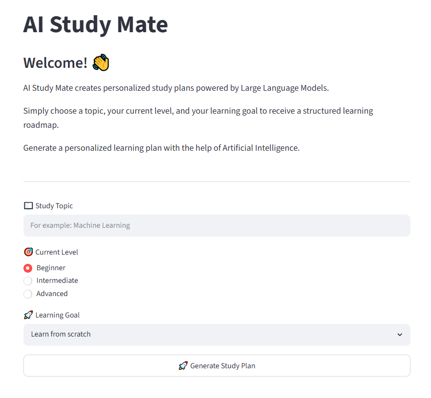
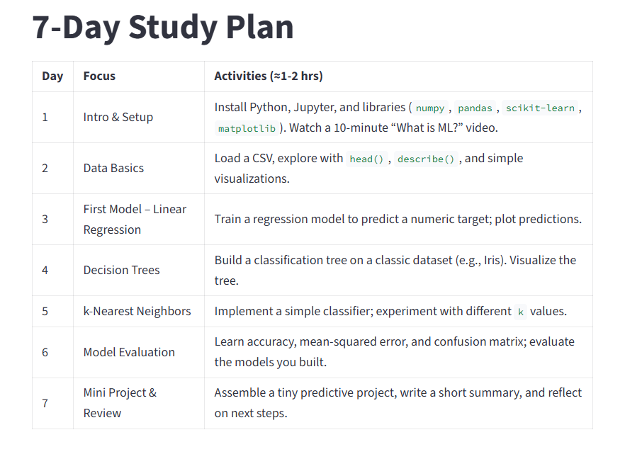
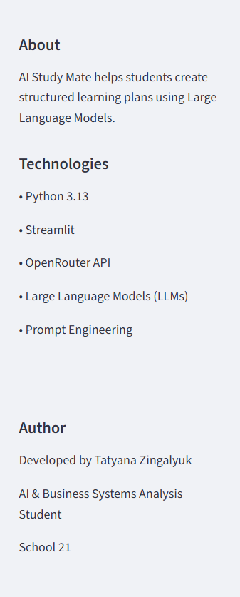

# 🤖 AI Study Mate


### Your personal AI-powered learning companion

<p align="center">
  
</p>

## 📖 About

AI Study Mate is an AI-powered web application that creates personalized study plans based on a student's topic, current knowledge level, and learning goals.

The application uses a Large Language Model (LLM) through the OpenRouter API to generate structured learning roadmaps with practical exercises and recommended resources.

## ✨ Features

- Generate personalized study plans
- Adapt learning materials to the student's level
- Set different learning goals
- Receive structured learning roadmaps
- Get practical exercises and mini projects
- Receive recommended learning resources
- Simple and intuitive web interface
  

## 📸 Screenshots

### Home Page



---

### Generated Study Plan



---

### Sidebar



## 🛠️ Technologies

| Technology | Purpose |
|------------|----------|
| Python 3.13 | Backend |
| Streamlit | User Interface |
| OpenRouter API | LLM Integration |
| Large Language Models | Study Plan Generation |
| Prompt Engineering | Response Quality |
| Git & GitHub | Version Control |

## 📂 Project Structure

AI-Study-Mate
│
├── assets/
├── app.py
├── config.py
├── llm.py
├── prompts.py
├── requirements.txt
├── README.md
└── .gitignore

## 🚀 Installation

```bash
git clone https://github.com/tatyana-zingalyuk/AI-Study-Mate.git

cd AI-Study-Mate

python -m venv venv

pip install -r requirements.txt

streamlit run app.py
```

## 💡 Future Improvements

## 🚀 Future Improvements

- Export study plans to PDF
- Save learning history
- User authentication
- Chat mode with the AI assistant
- Support for multiple languages
- Progress tracking dashboard
- Personalized recommendations based on previous sessions
  

## 📚 What I Learned

During this project I learned:

- Working with Large Language Models (LLMs)
- Prompt Engineering basics
- Building web applications with Streamlit
- Using REST APIs through OpenRouter
- Managing secrets with environment variables
- Organizing a Python project into modules
- Using Git and GitHub for version control


## 👩‍💻 Author

Developed by **Tatyana Zingalyuk**

Applied Informatics student

School 21 (Business Systems Analysis)

Interested in Artificial Intelligence, Machine Learning and Data Science.
📍 Moscow, Russia